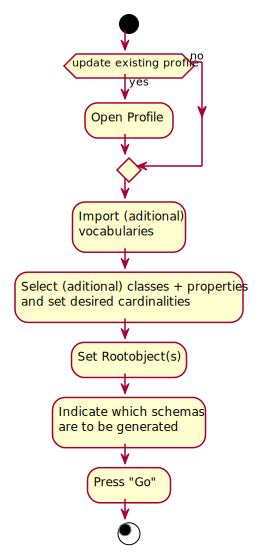

= mimirProfiler

== Introduction

This project aims to create tooling that allows data modellers to create link:https://www.w3.org/TR/dx-prof/[profiles] and specific technology-based link:https://www.w3.org/TR/dx-prof/#Role:schema[schema's] (like link:https://www.w3.org/TR/xmlschema11-1/[XSD], link:https://www.w3.org/TR/xmlschema11-1/[SQL table definitions], link:https://json-schema.org/[JSON schema], link:https://avro.apache.org/docs/current/spec.html[Apache Avro Schema]) based on link:https://www.w3.org/TR/dx-prof/#Role:vocabulary[vocabularies].

== Desired Functionality

The mimirProfiler should be able to allow users to create a link:https://www.w3.org/TR/dx-prof/[profile] based on a vocabulary. This vocabulary is typically expressed as a link:https://en.wikipedia.org/wiki/Web_Ontology_Language[Web Ontology Language (OWL)] or a link:https://en.wikipedia.org/wiki/Class_diagram[Unified Modelling Language (UML) Class Diagram].

image::documentation/figures/overviewDiagram.png[]

== The profiling process
The process through which the user will be able to create a profile is shown in the diagram below:

