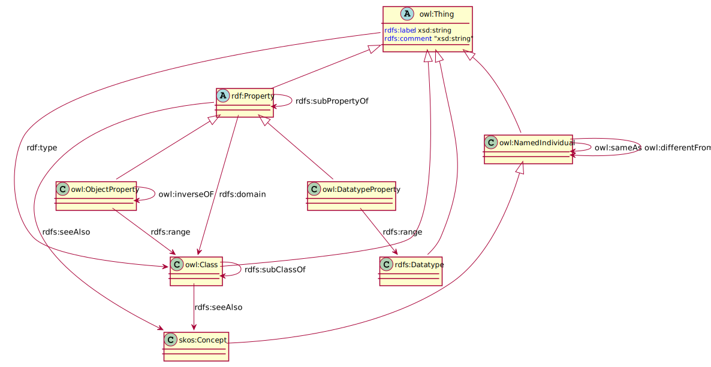

= mimirProfiler

== Introduction

This project aims to create tooling that allows data modellers to create link:https://www.w3.org/TR/dx-prof/[profiles] and specific technology-based link:https://www.w3.org/TR/dx-prof/#Role:schema[schema's] (like link:https://www.w3.org/TR/xmlschema11-1/[XSD], link:https://www.w3.org/TR/xmlschema11-1/[SQL table definitions], link:https://json-schema.org/[JSON schema], link:https://avro.apache.org/docs/current/spec.html[Apache Avro Schema]) based on link:https://www.w3.org/TR/dx-prof/#Role:vocabulary[vocabularies].

== Desired Functionality

The mimirProfiler should be able to allow users to create a profile based on a vocabulary. This vocabulary is typically expressed as a link:https://en.wikipedia.org/wiki/Web_Ontology_Language[Web Ontology Language (OWL)] or a link:https://en.wikipedia.org/wiki/Class_diagram[Unified Modelling Language (UML) Class Diagram].

image::documentation/figures/overviewDiagram.png[]

== Internal model of the mimirProfiler

=== Profile

The internal data model of the mimirProfiler is based on the link:https://www.w3.org/TR/dx-prof/[dx-Prof specification].

=== Vocabulary

The vocabulary is the open-world model that specifies (data) definitions in a use-case a-specific way. An important goal of such a vocabulary is to make data from different systems, processes and organizations interoperable.

In the mimirProfiler, the vocabulary is modelled according to the link:https://en.wikipedia.org/wiki/Web_Ontology_Language[OWL]

=== Constraints

The constraints are modelled conform the Shape and Constraints Language.

